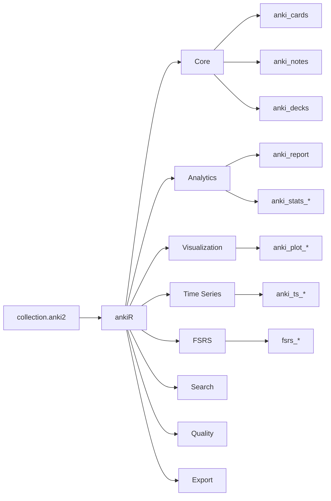
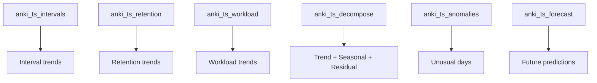
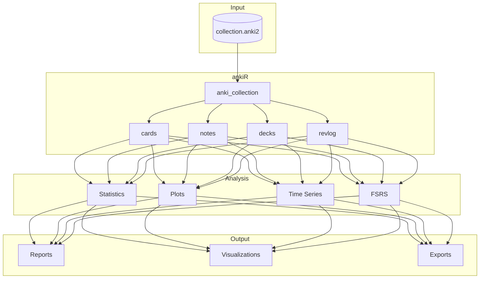

# ankiR

<!-- badges: start -->
[](https://github.com/chrislongros/ankiR/actions/workflows/R-CMD-check.yaml)
[](https://cran.r-universe.dev/ankiR)
<!-- badges: end -->

Comprehensive R toolkit for reading, analyzing, and visualizing [Anki](https://apps.ankiweb.net/) flashcard collection databases. **91 functions** with full support for FSRS (Free Spaced Repetition Scheduler).

## Installation

```r
# From r-universe (recommended)
install.packages("ankiR", repos = "https://cran.r-universe.dev")

# From GitHub
remotes::install_github("chrislongros/ankiR")

# Arch Linux (AUR)
# yay -S r-ankir
```

## Package Overview



## Quick Start

```r
library(ankiR)

# Get a comprehensive report
anki_report()
#> $total_cards
#> [1] 5847
#> 
#> $mature_cards
#> [1] 3892
#> 
#> $retention_rate
#> [1] 91.2
#> 
#> $current_streak
#> [1] 47
```

## Features

### Visualization

```r
anki_plot_heatmap()       # Calendar heatmap of reviews
anki_plot_retention()     # Retention over time
anki_plot_forecast()      # Upcoming workload
anki_plot_difficulty()    # FSRS difficulty distribution
anki_plot_intervals()     # Interval distribution
anki_plot_hours()         # Reviews by hour
anki_plot_weekdays()      # Reviews by weekday
```

### Time Series Analysis

```r
# Track interval growth
intervals <- anki_ts_intervals(by = "week")
#> # A tibble: 52 x 8
#>    date       reviews mean_ivl median_ivl pct_mature
#>    <date>       <int>    <dbl>      <dbl>      <dbl>
#>  1 2024-01-01     847     45.2         32       67.2
#>  2 2024-01-08     923     48.1         35       69.5

# Plot with trend
anki_ts_plot(intervals, "median_ivl", "Interval Growth")

# Detect unusual days
anki_ts_anomalies(threshold = 2)
#> # A tibble: 5 x 6
#>   date       reviews anomaly_type
#>   <date>       <int> <chr>
#> 1 2024-03-15     523 high_reviews
#> 2 2024-05-01      12 low_reviews

# Decompose into trend + seasonal + residual
decomp <- anki_ts_decompose()
plot(decomp)

# Find weekly patterns
anki_ts_autocorrelation()
#> Weekly pattern detected (autocorrelation at lag 7: 0.42)
```



### Search (Anki-like syntax)

```r
anki_search("deck:Medical tag:cardiology")
anki_search("is:due -is:suspended prop:ivl>30")

# Quick filters
anki_leeches(threshold = 8)
#> # A tibble: 23 x 5
#>         cid lapses   ivl sfld
#>       <dbl>  <int> <int> <chr>
#> 1 148293847     12     3 "What is the mechanism..."

anki_mature()
anki_due()
anki_suspended()
```

### FSRS Support

```r
# FSRS parameters
anki_cards_fsrs()
#> # A tibble: 5,847 x 5
#>         cid stability difficulty decay last_review
#>       <dbl>     <dbl>      <dbl> <dbl> <date>
#> 1 148293847      45.2       4.32  0.52 2024-06-15

# Current retrievability
fsrs_current_retrievability()

# Forgetting index
fsrs_forgetting_index(target_retention = 0.9)
#> $forgetting_index
#> [1] 12.3
#> $cards_below_target
#> [1] 557

# Time to mastery
fsrs_time_to_mastery(deck = "Medical")
#> $estimated_days_to_target
#> [1] 45
```

### Comparative Analysis

```r
# This month vs last month
anki_compare_periods()
#> # A tibble: 3 x 6
#>   period    total_reviews avg_per_day retention
#>   <chr>             <int>       <dbl>     <dbl>
#> 1 June 2024          4521       161.       91.2
#> 2 July 2024          4892       181.       92.1
#> 3 Change              371        20.1       0.9

# Benchmark vs FSRS averages
anki_benchmark()
```

### Card Quality

```r
anki_quality_report()
#> $recommendations
#> [1] "! 0.5% of notes have empty fields"
#> [2] "! 0.8% of cards are leeches"

anki_similar_cards(threshold = 0.9)  # Find duplicates
anki_tag_analysis()                   # Tag usage
```

### Export

```r
anki_to_csv("Medical", "medical.csv")
anki_to_org("Medical", "medical.org")
anki_to_markdown("Medical", "medical.md", format = "obsidian")
anki_to_html("report.html")
fsrs_export_reviews("reviews.csv")
```

### Interactive Dashboard

```r
anki_dashboard()  # Launches Shiny app
```

## Data Flow



## Function Reference

| Category | Count | Functions |
|----------|------:|-----------|
| Core | 8 | `anki_collection`, `anki_cards`, `anki_notes`, `anki_decks`, `anki_models`, `anki_revlog` |
| Analytics | 12 | `anki_report`, `anki_stats_deck`, `anki_stats_daily`, `anki_retention_rate`, `anki_streak` |
| Plotting | 8 | `anki_plot_heatmap`, `anki_plot_retention`, `anki_plot_forecast`, `anki_plot_difficulty` |
| Time Series | 11 | `anki_ts_intervals`, `anki_ts_retention`, `anki_ts_decompose`, `anki_ts_anomalies`, `anki_ts_forecast` |
| Compare | 5 | `anki_compare_decks`, `anki_compare_periods`, `anki_benchmark` |
| Search | 7 | `anki_search`, `anki_leeches`, `anki_suspended`, `anki_due`, `anki_mature` |
| Quality | 6 | `anki_quality_report`, `anki_similar_cards`, `anki_tag_analysis` |
| FSRS | 14 | `fsrs_retrievability`, `fsrs_forgetting_index`, `fsrs_review_burden`, `fsrs_time_to_mastery` |
| Media | 5 | `anki_media_list`, `anki_media_unused`, `anki_media_missing` |
| Export | 8 | `anki_to_csv`, `anki_to_org`, `anki_to_markdown`, `anki_to_html` |
| Dashboard | 1 | `anki_dashboard` |
| **Total** | **91** | |

## Requirements

- R >= 4.1
- Anki 2.1+ (collection.anki2 format)
- Optional: ggplot2 (plots), shiny (dashboard)

## License

MIT
