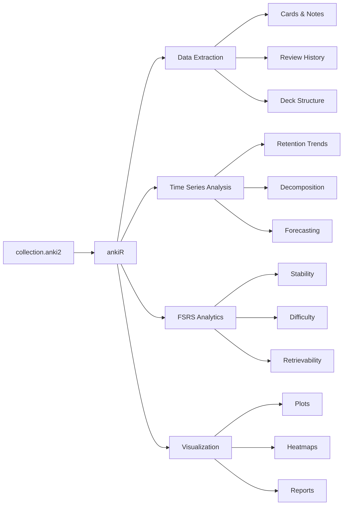

# ankiR

[](https://github.com/chrislongros/ankiR/actions/workflows/R-CMD-check.yaml)
[](https://chrislongros.r-universe.dev/ankiR)
[](https://CRAN.R-project.org/package=ankiR)
[](https://cran.r-project.org/package=ankiR)

Comprehensive R toolkit for reading, analyzing, and visualizing [Anki](https://apps.ankiweb.net/) flashcard collection databases. **91 functions** with full support for FSRS (Free Spaced Repetition Scheduler).

## Installation

```r
# From r-universe (recommended - latest version 0.5.0)
install.packages("ankiR", repos = "https://chrislongros.r-universe.dev")

# From CRAN
install.packages("ankiR")

# From GitHub (development)
remotes::install_github("chrislongros/ankiR")
```

## Anki Addon

An Anki addon version is also available: [ankiR Stats on AnkiWeb](https://ankiweb.net/shared/info/419954163)

Install in Anki with code: `419954163`

## Quick Start

```r
library(ankiR)

# Read your collection
col <- read_anki("~/.local/share/Anki2/User 1/collection.anki2")

# Get review history
reviews <- get_reviews(col)

# Calculate retention over time
retention <- ts_retention(reviews, period = "week")

# Plot it
plot_retention(retention)
```

## Package Overview



## Sample Visualizations

### Weekly Retention with Trend


### Review Heatmap


### Time Series Decomposition


## Time Series Functions

| Function | Description |
|----------|-------------|
| `ts_reviews()` | Aggregate reviews by time period |
| `ts_retention()` | Calculate retention over time |
| `ts_intervals()` | Track interval changes over time |
| `ts_workload()` | Measure daily/weekly workload |
| `ts_decompose()` | Decompose into trend + seasonal + residual |
| `ts_autocorrelation()` | Find cyclical patterns |
| `ts_anomalies()` | Detect unusual study days |
| `ts_forecast()` | Predict future reviews |
| `ts_streak()` | Calculate study streaks |
| `ts_moving_average()` | Smooth time series data |
| `ts_cumulative()` | Cumulative statistics over time |

## Function Categories

| Category | Count | Description |
|----------|-------|-------------|
| Data Import | 8 | Read collections, extract data |
| Card Analysis | 12 | Analyze cards, notes, decks |
| Review Analysis | 15 | Process review history |
| Time Series | 11 | Temporal analysis and forecasting |
| FSRS | 10 | FSRS scheduler analytics |
| Visualization | 14 | Plots and charts |
| Search | 6 | Search cards and content |
| Comparison | 5 | Compare decks, time periods |
| Export | 5 | Export to various formats |
| Utilities | 5 | Helper functions |

## FSRS Support

Full support for Anki's FSRS scheduler:

```r
# Get FSRS parameters for all cards
fsrs_data <- get_cards_fsrs(col)

# Calculate current retrievability
retrievability <- fsrs_retrievability(fsrs_data)

# Find cards below target retention
at_risk <- fsrs_forgetting_index(fsrs_data, target = 0.9)

# Analyze stability distribution
stability_stats <- fsrs_stability_distribution(fsrs_data)
```

## Requirements

- R ≥ 4.1.0
- Anki collection file (collection.anki2)

## License

MIT

## Links

- [CRAN](https://cran.r-project.org/package=ankiR)
- [r-universe](https://chrislongros.r-universe.dev/ankiR)
- [GitHub](https://github.com/chrislongros/ankiR)
- [Anki Addon](https://ankiweb.net/shared/info/419954163)
